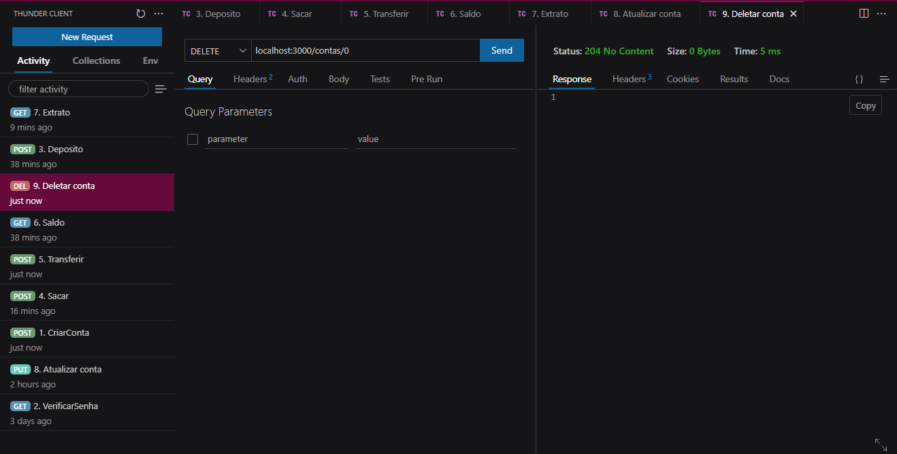
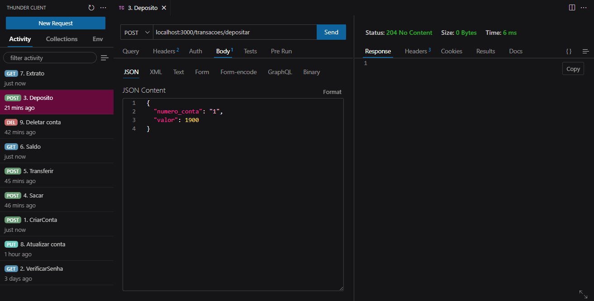
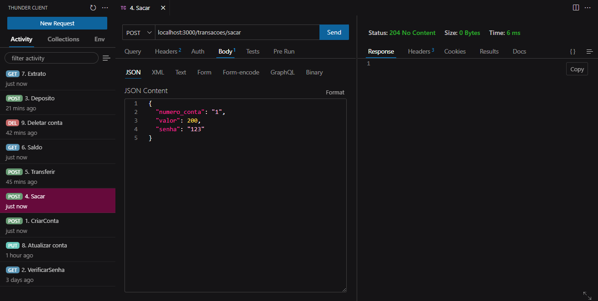
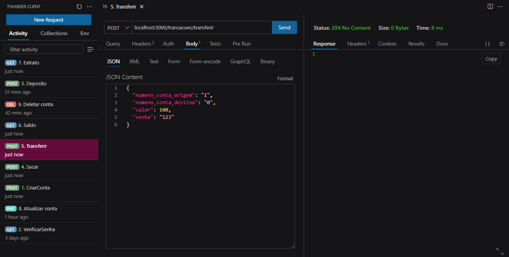
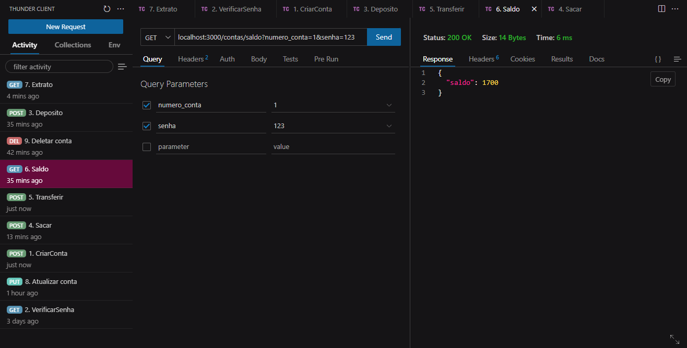
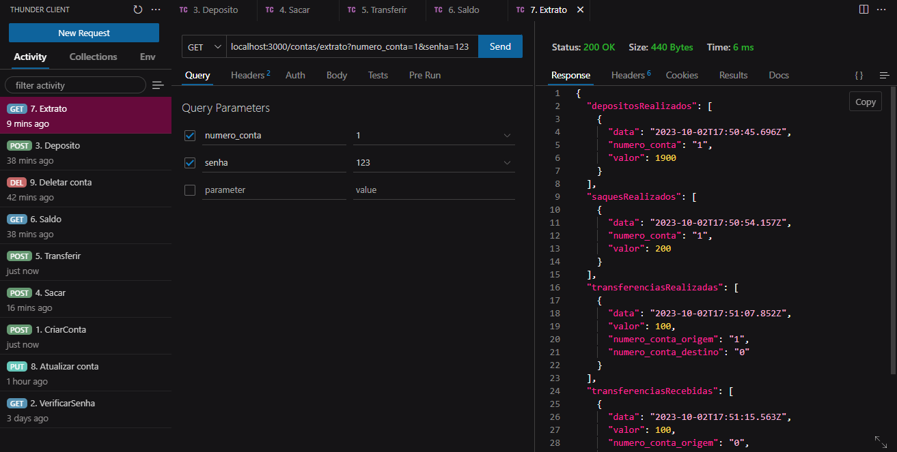

<h1 align="center"> 
	API REST Banco Digital 💻
</h1>

 <a href="#-sobre-o-projeto">Sobre</a> •
 <a href="#-como-executar-o-projeto">Como executar</a> • 
  <a href="#-pre-requisitos">Requisitos</a> • 
 <a href="#-linguagem-utilizada">Tecnologias</a> • 

## 💻 Sobre o projeto

Este projeto é o desenvolvimento de uma API para um Banco Digital, feito como desafio do Modulo II do curso de desenvolvimento de software com foco em Back-end da **Cubos Academy** em parceria com a **Ifood**. Esse será um projeto **piloto**, ou seja, no futuro outras funcionalidades serão implementadas, portanto, dados do banco (nome, agência, etc.) serão imutáveis. 

Essa API utiliza o padrão REST e permite aos usuários:

-   Criar conta bancária
-   Listar contas bancárias
-   Atualizar os dados do usuário da conta bancária
-   Excluir uma conta bancária
-   Depósitar em uma conta bancária
-   Sacar de uma conta bancária
-   Transferir valores entre contas bancárias
-   Consultar saldo da conta bancária
-   Emitir extrato bancário

## ✅ Como executar o projeto

- A API estará disponível em http://localhost:3000.
- Para realizar requisições com os verbos POST, PUT, DELETE use a extensão Thunder Client do VSCode, o aplicativo Insomnia ou similar.
- Os dados serão persistidos em memória, no objeto existente dentro do arquivo `bancodedados.js`.]

### Listar contas bancárias

- Esse endpoint irá listar todas as contas bancárias existentes.

### Criar conta bancária

- Esse endpoint irá criar uma conta bancária, onde será gerado um número único para identificação da conta (número da conta).

### Atualizar usuário da conta bancária

- Esse endpoint irá atualizar apenas os dados do usuário de uma conta bancária.

### Excluir Conta

- Esse endpoint irá excluir uma conta bancária existente.

### Depositar

- Esse endpoint irá somar o valor do depósito ao saldo de uma conta válida e registrar essa transação.

### Sacar

- Esse endpoint irá realizar o saque de um valor em uma determinada conta bancária e registrar essa transação.

### Tranferir

- Esse endpoint irá permitir a transferência de recursos (dinheiro) de uma conta bancária para outra e registrar essa transação.

### Consultar Saldo

- Esse endpoint irá retornar o saldo de uma conta bancária.

### Extrato

- Esse endpoint irá listar as transações realizadas de uma conta específica.

### Pré-requisitos:

- [Git](https://git-scm.com)
- [Node.js](https://nodejs.org/en/)
- [VSCode](https://code.visualstudio.com/)

## 🛠 Linguagens e Tecnologias utilizadas:

- [JavaScript](https://developer.mozilla.org/pt-BR/docs/Web/JavaScript)

## Desenvolvedora

| [ Karolayne Arantes](https://www.linkedin.com/in/karolayne-arantes-b544b526b/) |
| :---: |

#### ⚠️ Importante: Este é um projeto de demonstração e não representa um sistema bancário real. Todas as operações são fictícias e apenas para fins educacionais.

###### tags: `back-end` | `nodeJS` | `API REST`

